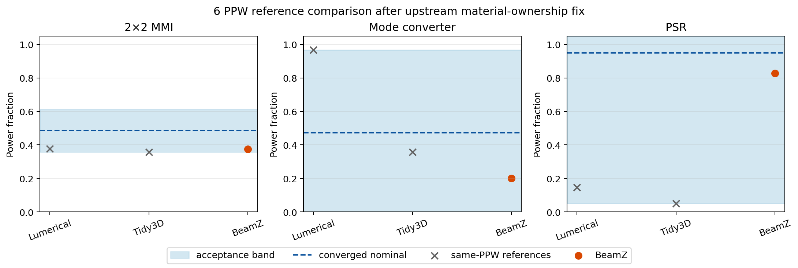
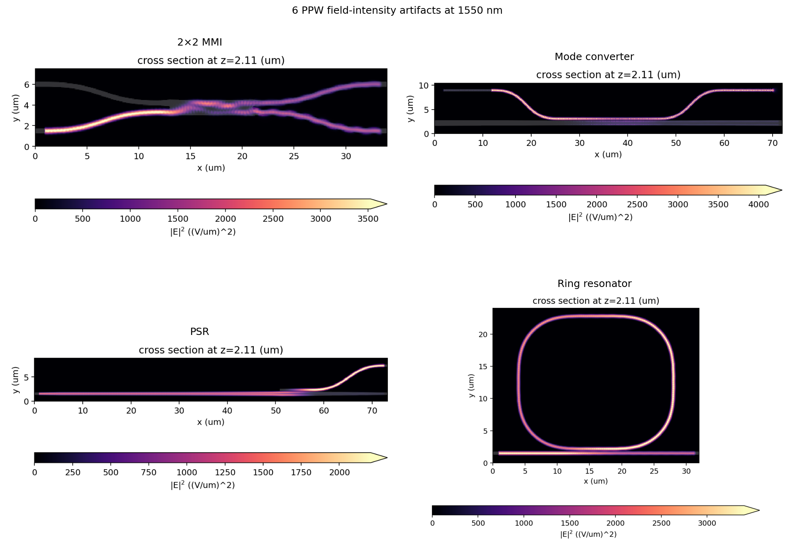

# Additional passive-SOI devices after the material-ownership fix

Four fresh-process JAX/GPU simulations on commit `da35b52`, rebased onto PR 230 head `06ab298`. The base includes upstream `main` through #244 and the material-ownership rasterization fix. Every device uses the lowest repository setting of 6 cells per wavelength and a 20 nm source bandwidth.

## Results

| Device | BeamZ result | Same-PPW Lumerical / Tidy3D | Acceptance interval | Outcome |
| --- | ---: | ---: | ---: | --- |
| 2×2 MMI cross TE0 | 0.374549 | 0.376 / 0.358 | 0.358–0.612 | pass |
| Mode converter TE1 | 0.200297 | 0.967 / 0.357 | -0.021–0.967 | power comparison passes |
| Polarization splitter-rotator TE0 | 0.827823 | 0.147 / 0.051 | 0.051–1.8475 | pass |
| Ring terminal field decay | 0.121169 | no committed solver result | ≤1e-5 | strict xfail |



The shaded intervals use the benchmark's resolution-conditioned rule: the converged nominal plus or minus the larger deviation of the two published solvers at 6 PPW. They are numerical acceptance bands, not confidence intervals, and may extend outside the physical 0–1 power range.

The mode converter's center conversion passes, but its selected output-power ratio reaches 1.123259 across the wavelength band and violates the separate 1.02 bound. Its test therefore remains a strict expected failure. The ring completes 24,199 steps on JAX without an allocation failure, but reaches its 3.20 ps time limit before satisfying field-decay convergence; resonance metrics remain characterization only.

## Field evidence



All four runs retain finite raw monitor arrays, geometry and overview plots, run metadata, and validation reports locally. The committed [measurements](measurements.json) preserve the validation records and execution metadata; [summary.csv](summary.csv) provides the three paper-backed power comparisons.

## Environment and scope

- GPU: NVIDIA GeForce RTX 4060 Ti 8 GiB under WSL2.
- Backend: JAX for every device; the ring used `XLA_PYTHON_CLIENT_PREALLOCATE=false`.
- MMI, mode converter, and PSR report `converged`; the ring reports `time_limit`.
- These runs validate the lowest setting only and do not establish asymptotic mesh convergence.
- BeamZ still uses fixed 1550 nm material indices, diagonal Farjadpour smoothing rather than Tidy3D contour-path averaging, and documented in-domain monitor apertures.

## Reproduction

Run each device in a fresh process so host and GPU allocations are released between cases:

```sh
XLA_PYTHON_CLIENT_PREALLOCATE=false \
BEAMZ_EXECUTION_BACKEND=jax \
BEAMZ_VALIDATION_ARTIFACT_DIR=validation-artifacts/upstream-main-6ppw \
uv run pytest -q \
  'tests/differential/test_mmi2x2.py::test_mmi2x2_cross_power_agrees_with_converged_reference[6ppw]' \
  --validation-report=validation-results-mmi2x2-6ppw.json
```

Use the corresponding 6 PPW node from `test_mode_conversion.py` or `test_ring_resonator.py` for the other devices.
