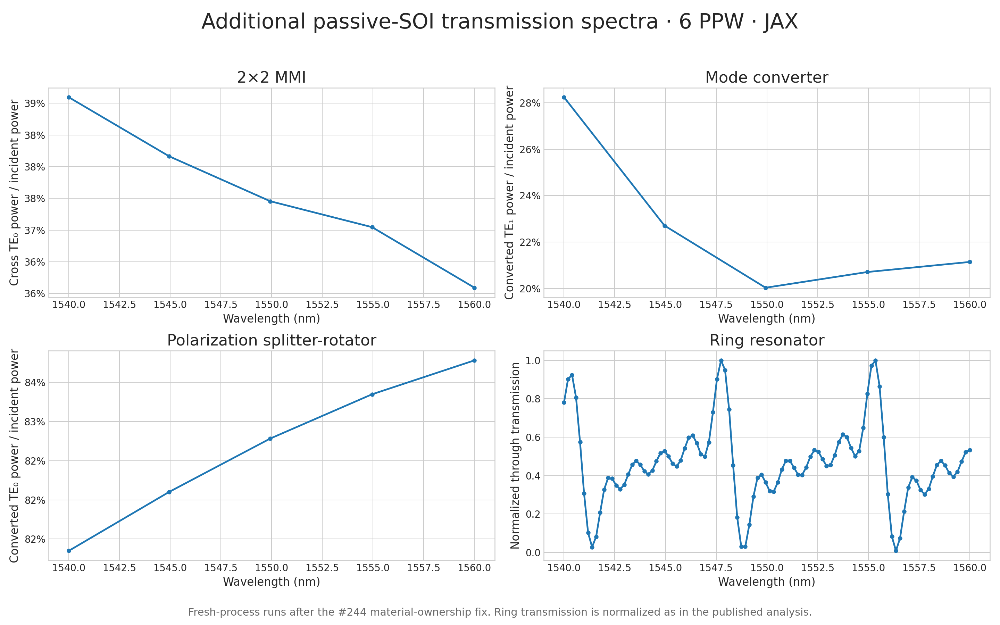
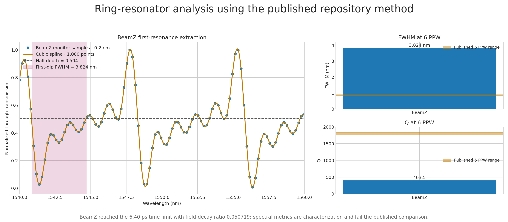

# Additional passive-SOI devices after the material-ownership fix

Four fresh-process JAX/GPU simulations through commit `5434c5f`, rebased onto merged PR 230 at `8274dd5`. The base includes upstream `main` through #244 and the material-ownership rasterization fix. Every device uses the lowest repository setting of 6 cells per wavelength and a 20 nm source bandwidth. The ring uses the 6.40 ps duration selected by the upstream script's default Lumerical silicon path.

## Results

| Device | BeamZ result | Same-PPW Lumerical / Tidy3D | Acceptance interval | Outcome |
| --- | ---: | ---: | ---: | --- |
| 2×2 MMI cross TE0 | 0.374549 | 0.376 / 0.358 | 0.358–0.612 | pass |
| Mode converter TE1 | 0.200297 | 0.967 / 0.357 | -0.021–0.967 | power comparison passes |
| Polarization splitter-rotator TE0 | 0.827823 | 0.147 / 0.051 | 0.051–1.8475 | pass |
| Ring terminal field decay | 0.050719 | Figure 26 publishes 6 PPW spectral metrics | ≤1e-5 before accepting spectral metrics | strict xfail |


The shaded intervals use the benchmark's resolution-conditioned rule: the converged nominal plus or minus the larger deviation of the two published solvers at 6 PPW. They are numerical acceptance bands, not confidence intervals, and may extend outside the physical 0–1 power range.

The mode converter's center conversion passes, but its selected output-power ratio reaches 1.123259 across the wavelength band and violates the separate 1.02 bound. Its test therefore remains a strict expected failure. The ring completes 48,397 steps on JAX without an allocation failure, but reaches its 6.40 ps time limit before satisfying field-decay convergence; resonance metrics remain characterization only. Figure 26 contains Lumerical and Tidy3D ring results at 6 PPW, while the paper concludes that mesh convergence requires 20 PPW. The corrected duration reduces residual energy from 0.121169 to 0.050719. An independent `cuda_streamed` run reproduced the terminal ratio as 0.0507189.

## Spectral evidence



The plotted selected-mode arrays are committed in
[`spectra.json`](spectra.json), including wavelengths and quantity labels. The
ring retains all 101 monitor samples; the other devices retain the five
published comparison wavelengths used by their benchmark protocol. The
artifact SHA-256 hashes in [`measurements.json`](measurements.json) bind those
arrays to the retained raw monitor files. Run `uv run python
tests/differential/results/rtx4060ti-2026-09-15/plot_results.py` to regenerate
both spectral figures.



The ring panel applies the pinned supplementary `find_FWHM.py` procedure:
normalize the transmission, cubic-spline the monitor samples onto 1,000 points,
use `(1 + T_min) / 2` as the half-depth level, and measure the first complete
dip. BeamZ gives a 3.8238 nm FWHM and Q 403.46, outside the published 6 PPW
ranges of 0.84--0.90 nm and 1756.5--1839.4. Its 7.4892 nm median FSR lies
between the paper's approximate 7.4 nm Lumerical and 7.6 nm Tidy3D values. The
committed [`ring_summary.csv`](ring_summary.csv) records these values without
allowing the FSR agreement to override the failed linewidth and decay checks.

## Field evidence


All four runs retain finite raw monitor arrays, geometry and overview plots,
run metadata, and validation reports locally. The committed
[`measurements.json`](measurements.json) preserves validation records,
execution metadata, spectral metrics, and raw-artifact hashes.
[`summary.csv`](summary.csv) now includes all four devices; the ring's scalar
spectral metrics are expanded in [`ring_summary.csv`](ring_summary.csv).

## Environment and scope

- GPU: NVIDIA GeForce RTX 4060 Ti 8 GiB under WSL2.
- Backend: JAX for every device; the ring used `XLA_PYTHON_CLIENT_PREALLOCATE=false`.
- MMI, mode converter, and PSR report `converged`; the ring reports `time_limit`.
- These runs validate the lowest setting only and do not establish asymptotic mesh convergence.
- BeamZ still uses fixed 1550 nm material indices, diagonal Farjadpour smoothing rather than Tidy3D contour-path averaging, and documented in-domain monitor apertures.

## Reproduction

Run each device in a fresh process so host and GPU allocations are released between cases:

```sh
XLA_PYTHON_CLIENT_PREALLOCATE=false \
BEAMZ_EXECUTION_BACKEND=jax \
BEAMZ_VALIDATION_ARTIFACT_DIR=validation-artifacts/upstream-main-6ppw \
uv run pytest -q \
  'tests/differential/test_mmi2x2.py::test_mmi2x2_cross_power_agrees_with_converged_reference[6ppw]' \
  --validation-report=validation-results-mmi2x2-6ppw.json
```

Use the corresponding 6 PPW node from `test_mode_conversion.py` or `test_ring_resonator.py` for the other devices.
